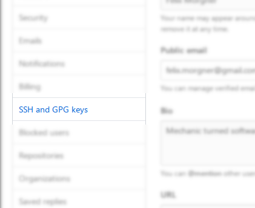
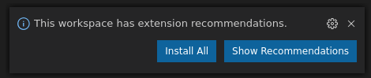
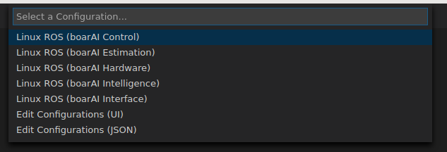

===================
ROS2 Development VM
===================

This Virtual Machine Appliance provides a development environment for working on
ROS2 projects. It is based on *Arch Linux* and ships with a number of packages
pre-installed, most notably:

- ROS2
- Visual Studio Code Insiders

IMPORTANT: Update ROS2 Repository Settings
==========================================

If you are using an older build of the VM, you will probably need to update the
ROS2 repository configuration. Replace the current **[ros2]** entry in
**/etc/pacman.conf** by this one:

.. code-block::

   [ros2]
   Server = https://arch.arknet.ch/ros2
   SigLevel = Never

Getting Started
===============

First and foremost, you need to know how to log in into the virtual machine. Use
the following default credentials:

user
   hsr
password
   asimov

Git Setup
---------

Make sure to set up your git user name and email address. To do so open a
terminal via *Applications -> System Tools -> MATE Terminal* and use the
following commands to set your git configuration:

.. code-block::

   $ git config --global user.name "<your_name_here>"
   $ git config --global user.email "<your_email_address_here>"

Github SSH Setup
~~~~~~~~~~~~~~~~

You may also want to generate a new SSH key-pair for use with the remote git
repository. You can do this from the terminal using the following commands:

.. code-block::

   $ ssh-keygen -t ed25519

You may accept the defaults by simply pressing return when asked for the target
file name and password. You will need to register the newly generated SSH key
with GitHub. To do so, you will need to register the **public** part of your new
SSH key-pair. You can print your **public** key using the following command from
any terminal:

.. code-block::

   $ cat ~/.ssh/id_ed25519.pub

Public keys look similar to this:

.. code-block::

   ssh-ed25519 AAAAC3NzaC1lZDI1NTE5AAAAIFD7+VSLGvsMY5LATCPQPFi8+tMLf1OiDnwBWfavZENK hsr@vm

If your output looks like a garbled mess, you more than likely have tried to
print your **private** instead of yout **public** key. It is important, that you
never share your **private** key with anyone!

You will then need to log in to your github account using a webbrowser. The
virtual machine provides you with a simple integrated browser, but you might
want to use an external browser on your host system. When you have logged in to
your account, click the avatar in the upper right corner.

From the drop-down menu select *Settings*. This will take you to the settings
page of your github account. From there, select *SSH and GPG keys* from the
menu on the left side of the page.

This will take you to a settings page that will allow you to manage you SSH and
GPG keys. Click the *New SSH key* button on the top right-hand side of this
page.

You will now be presented with an input form, that allows you to register new
SSH public keys for authentication with github. Simply paste your **public** key
in the field labled *Key*. Make sure that you are pasting your **public** key,
not your **private** key! You may want to give your new key a title that allows
you to remember what it is used for. The last step in registering your SSH key
with Github is to click the *Add SSH key* button.

Initial Clone
~~~~~~~~~~~~~

You are now ready to clone the *boarAI Firmware* repository. Firstly you will
create a new directory called `code`. All source code associated with the
project will live there. After creating the directory, simply clone the firmware
repository. You can use the commands shown below to achive both tasks:

.. code-block::

   $ mkdir ~/code
   $ git clone --recurse-submodules git@github.com:ILT-HSR/boarai-firmware.git code/firmware

During clone process you may need to confirm the authenticity of github.com. Do this by entering *yes* and hit return.

Building the Code
-----------------

ROS2 uses the *colcon* meta-build utility, making it easy to build the firmware
code. Simply open a terminal and change to your clone of the firmware
repository. If you have followed this guide up to this point, you can use the
following command to do this:

.. code-block::

   $ cd ~/code/firmware

With your working directory being set to the location of your firmware clone,
simply issue the following command to build the firmware:

.. code-block::

   $ colcon build --symlink-install

Note that the build process make take some time, especially when starting from
a clean clone.

IDE Setup
---------

The virtual machine provides you with an installation of *Visual Studio Code
Insiders*. The firmware repository includes configuration files to make the
use of VSCode easier. If you closed the old terminal instance, open a new one
and change your working directory to your clone of the firmware repository.
From there, use the following command to start VSCode in your clone:

.. code-block::

   code-insiders .

Give the IDE some time when starting up. It will most likely ask you, if you
want to install the extensions recommended by the workspace, look out for a
notification in the lower right-hand corner

Simply click the *Install All* button and give the IDE some time to install the
extensions. After the installation has finished, VSCode might ask you to reload
the IDE. Either click the *Reload* button if one is provided or press the
shortcut *Ctrl+Shift+P* and type *Reload Window* into the pop-up at the top
center of the IDE window (make sure you **don't** delete the **>** at the start
of the text field!) and hit return.

Working on Different Layers
~~~~~~~~~~~~~~~~~~~~~~~~~~~

The *boarAI Firmware* is separated into different layers/packages. Since every
package will have a different set of dependencies as well as source files, the
firmware repository includes a set of different configuration for the C++ IDE
plugin. You can switch between these configurations by bringing up the command
interface of the IDE (using the shortcut *Ctrl+Shift+P*) and typing "Select a
Configuration". Hit return, and the IDE will present you with list of diffrent
configurations to choose from. Simply select the appropriate configuration for
the subsystem you are working on.

It might take a couple of seconds for the IDE to reload the plugin
configuration.
